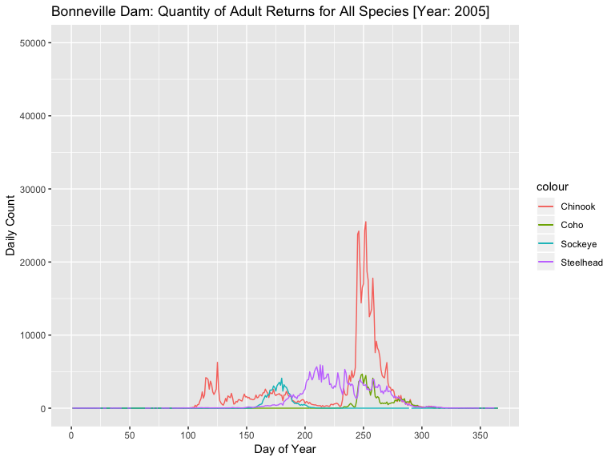
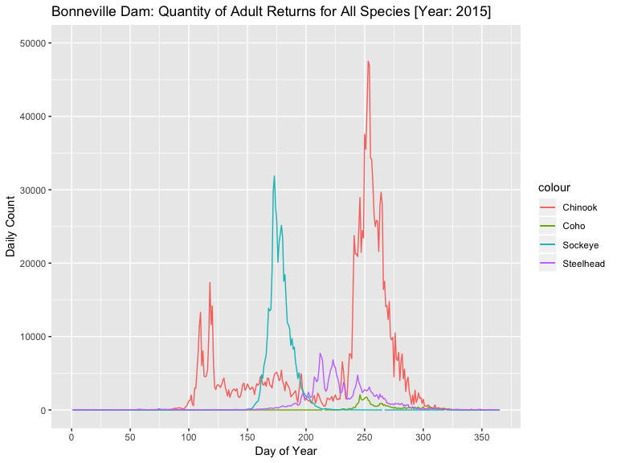
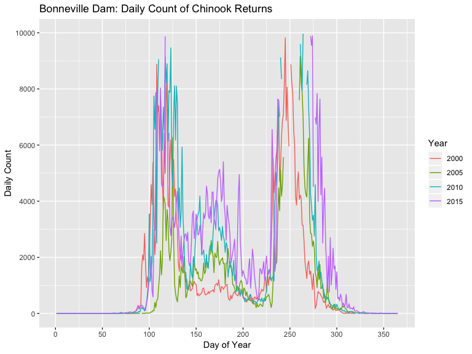
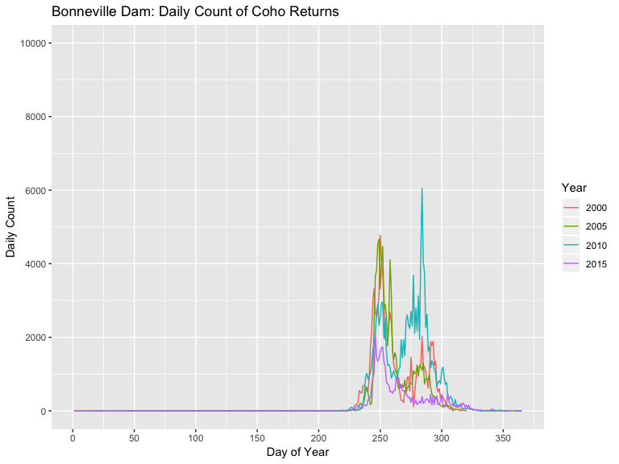
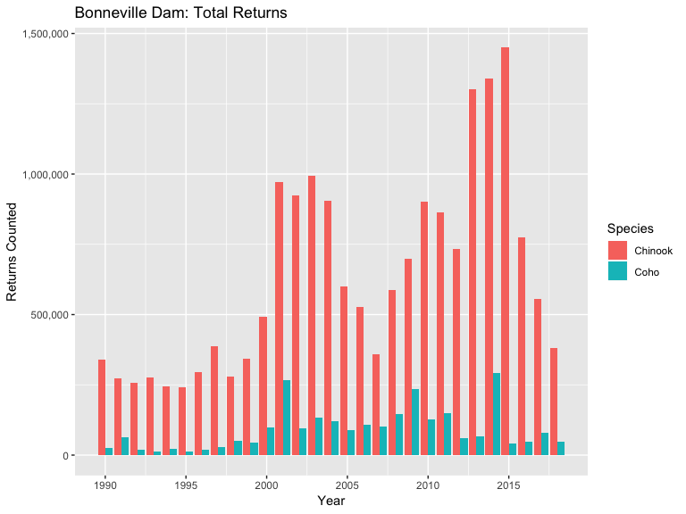

Columbia River Adult Salmon Returns: Exploratory Data Analysis
================
[Jim Tyhurst](https://www.jimtyhurst.com/)
2019-03-08

  - [Configuration](#configuration)
  - [Data preparation](#data-preparation)
  - [Plots for Bonneville Dam for years 2005 and
    2015](#plots-for-bonneville-dam-for-years-2005-and-2015)
  - [Plots for Bonneville Dam from 1990 to
    2018](#plots-for-bonneville-dam-from-1990-to-2018)
  - [References](#references)

🔻 *Work in Process* … 🔺

Source code at:
[columbia-river-adult-salmon-returns.Rmd](../vignettes/columbia-river-adult-salmon-returns.Rmd)

## Configuration

``` r
library(salmonstats)
library(glue)
library(tidyverse)
library(lubridate)
#> 
#> Attaching package: 'lubridate'
#> The following object is masked from 'package:base':
#> 
#>     date
```

## Data preparation

Daily counts were obtained by manually selecting search parameters from
the [Fish Passage Center](http://www.fpc.org/)’s [Adult Data
Query](http://www.fpc.org/web/apps/adultsalmon/Q_adultcounts_dataquery.php)
page:

  - *passage reporting site* : This exploration uses observations from
    the [Bonneville Dam](https://www.nwp.usace.army.mil/bonneville/),
    which is abbreviated as ‘BON’ in the ‘Dam’ column of the data.
  - *species* : I always left the default value ‘All Species’.
  - *start date* : I always selected ‘January 1’ of the selected year.
  - *end date* : I always selected ‘December 31’ of the selected year.

After downloading each file of data, the final two lines of each file
needed to be deleted, because they were annotations that were *not* part
of the data to be analyzed. Then I changed the name of the files to
match:

> fpc-salmon-{passage\_reporting\_site\_abbreviation}-{year}0101-{year}1231.csv

For example, the following files are for data from Bonneville Dam (BON)
from years 2005 and 2015, respectively:

> fpc\_salmon-BON-20050101-20051231.csv  
> fpc\_salmon-BON-20150101-20151231.csv

Metadata is available from the [Fish Passage Center Adult
Metadata](http://www.fpc.org/documents/metadata/FPC_Adult_Metadata.html)
web page. In particular, Bonneville Dam data only has observations from
March 15 to November 15 for years up to 2001. Starting in 2002,
observations were made every day during the year.

🔻 *Open Issue*: There are quite a few daily count values that are
negative. What does that mean? Maybe more fish went downstream through
the passage reporting site than upstream? I looked through the
[metadata](http://www.fpc.org/documents/metadata/FPC_Adult_Metadata.html),
but I did not see an explanation for these negative field values. 🔺

``` r
# Replace the path components with the location of your data.
data_directory <- file.path("..", "inst", "extdata", "ColumbiaRiver-FishPassageCenter", "BonnevilleDam")

bon2005 <- get_fpc_data(2005, "BON", data_directory)
bon2015 <- get_fpc_data(2015, "BON", data_directory)
```

## Plots for Bonneville Dam for years 2005 and 2015

``` r
plot_single_fpc_file(bon2005, 2005, "Bonneville Dam")
#> Warning: Removed 1 rows containing missing values (geom_path).
```



Chinook salmon run in spring and fall, as shown by the two bumps around
days 120 and 250. The other species only have a single run per
year.

``` r
plot_single_fpc_file(bon2015, 2015, "Bonneville Dam")
```



Comparing these last two plots, I am surprised that the numbers for 2015
are so much bigger than for 2005.

## Plots for Bonneville Dam from 1990 to 2018

Each year of data is in one CSV file in a subdirectory of `inst/extdata`
with a separate directory for each passage reporting site. The data is
not too big, so we read all the data into a single data.frame:

``` r
first_year <- 1990
last_year <- 2018
passage_reporting_site_name <- "Bonneville Dam"
passage_reporting_site_code <- "BON"

# Concatenates the files into a single tibble.
multi_year <- first_year:last_year %>% 
  purrr::map(function(year) {get_fpc_data(year, passage_reporting_site_code, data_directory)}) %>% 
  purrr::reduce(function(x, y) {dplyr::bind_rows(x, y)}) %>% 
  dplyr::select(
    Dam, Year, DayOfYear, 
    ChinookAdult, ChinookJack, Chinook, 
    CohoAdult, CohoJack, Coho, 
    Steelhead, UnclippedSteelhead, 
    Sockeye, Pink, Chum, 
    Date
  )
dim(multi_year)
#> [1] 9136   15
```

We plot a few years for Chinook to get a feel for the distribution:

``` r
multi_year %>% 
  dplyr::filter(Year %in% c(2000, 2005, 2010, 2015)) %>% 
  mutate(Year = factor(Year)) %>% 
  ggplot(aes(DayOfYear)) +
  geom_line(aes(y = Chinook, color = Year)) +
  ggtitle(
    glue("{passage_reporting_site}: Daily Count of {species} Returns",
         passage_reporting_site = passage_reporting_site_name,
         species = "Chinook")) +
  scale_x_continuous(name = "Day of Year", breaks = seq(0, 350, by = 50)) +
  scale_y_continuous(name = "Daily Count", limits = c(0, 10000), breaks = seq(0, 10000, by = 2000))
```



Those 4 years all have very similar distributions for Chinook. Let’s
look at the same years for Coho:

``` r
multi_year %>% 
  dplyr::filter(Year %in% c(2000, 2005, 2010, 2015)) %>% 
  mutate(Year = factor(Year)) %>% 
  ggplot(aes(DayOfYear)) +
  geom_line(aes(y = Coho, color = Year)) +
  ggtitle(
    glue("{passage_reporting_site}: Daily Count of {species} Returns",
         passage_reporting_site = passage_reporting_site_name,
         species = "Coho")) +
  scale_x_continuous(name = "Day of Year", breaks = seq(0, 350, by = 50)) +
  scale_y_continuous(name = "Daily Count", limits = c(0, 10000), breaks = seq(0, 10000, by = 2000))
#> Warning: Removed 1 rows containing missing values (geom_path).
```



This plot shows much more variation across years for Coho, as compared
to the previous plot for Chinook.

Let’s look more closely at the yearly trend. In the next plot, we sum
the daily observations, in order to compare total quantity for the whole
year.

In the years before 2002, data was only collected from March 15 to
November 15. Therefore, we exclude observations from outside those days
from 2002 and later, in order to be comparing similar date ranges for
data across all years. This leads to some underreporting of numbers for
2002 and later if just considering the total, but it makes for a more
consistent comparison with earlier years of observation.

🔻 *To Do*: Fix the following calculation to work for leap years. 🔺

``` r
first_observation_day <- 74  # March 15, except for leap year
last_observation_day <- 319  # Nov 15, except for leap year
multi_year  %>% 
  dplyr::filter(lubridate::yday(Date) >= first_observation_day,
                lubridate::yday(Date) <= last_observation_day) %>% 
  dplyr::group_by(Year) %>% 
  dplyr::mutate(
    ChinookCount = sum(Chinook),
    CohoCount = sum(Coho)
  ) %>%
  dplyr::select(Year, Chinook = ChinookCount, Coho = CohoCount) %>% 
  tidyr::gather(`Chinook`, `Coho`, key = "species", value = "Returns") %>% 
  unique() %>% 
  mutate(Species = factor(species)) %>% 
  ggplot(aes(Year, Returns, fill = Species)) +
  geom_bar(stat = "identity", position = "dodge") +
  scale_fill_discrete(
    name = "Species",
    breaks=c("Chinook", "Coho"),
    labels=c("Chinook", "Coho")
  ) +
  ggtitle(
    glue("{passage_reporting_site}: Total Returns",
         passage_reporting_site = passage_reporting_site_name)
  ) +
  scale_x_continuous(name = "Year", breaks = seq(1990, 2015, by = 5)) +
  scale_y_continuous(name = "Returns Counted", labels = function(x){format(x, scientific = FALSE, big.mark = ",")})
```



We see that the total returns for the two species are *not* strongly
correlated.

🔻 *To Do*: Need to calculate quantitative measure of (lack of)
correlation between the total returns for the two species. Use
`cor.test` to calculate correlation coefficient and `p-value`. 🔺

🔻 *To Do*: Add other species to the plot. Change to a line plot, so that
it is easier to see the trends? 🔺

🔻 *To Do*: Extend this plot to earlier years. 🔺

## References

Source code:
[columbia-river-adult-salmon-returns.Rmd](../vignettes/columbia-river-adult-salmon-returns.Rmd)

Data source:
<http://www.fpc.org/web/apps/adultsalmon/Q_adultcounts_dataquery.php>

Metadata:
<http://www.fpc.org/documents/metadata/FPC_Adult_Metadata.html>
