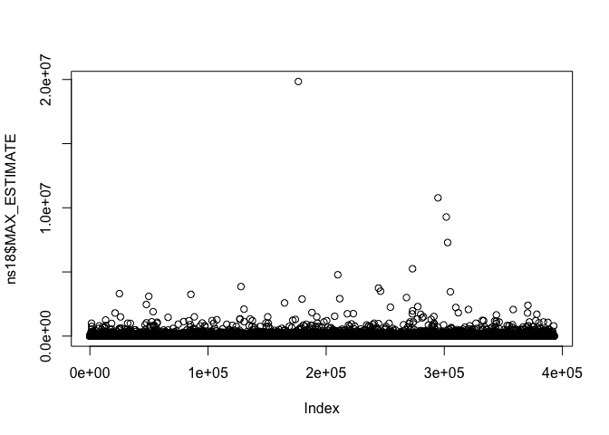

NuSEDS Adult Salmon Escapement Data: Exploratory Data Analysis
================
[Jim Tyhurst](https://www.jimtyhurst.com/)
2019-03-07

  - [Configuration](#configuration)
  - [New Salmon Escapement Database System
    (NuSEDS)](#new-salmon-escapement-database-system-nuseds)
  - [MAX\_ESTIMATE](#max_estimate)
  - [References](#references)

🔻 *Work in Process* … 🔺

Source code at:
[nuseds-adult-salmon-escapement-data.Rmd](../vignettes/nuseds-adult-salmon-escapement-data.Rmd)

## Configuration

``` r
library(salmonstats)
library(descriptr)
library(tidyverse)
```

## New Salmon Escapement Database System (NuSEDS)

[NuSEDS](https://open.canada.ca/en/suggested-datasets/new-salmon-escapement-database-nuseds)
is the Pacific Region’s centralized Oracle database that holds adult
salmon escapement data. About 10,000 salmon spawning sites in DFO
Pacific Region have been observed 0 to 10 times per year for 6 species
for nearly 100 years (poorly before 1948). Data is aggregated within
year; the raw data is largely on paper.

  - zip file containing
    NUSEDS\_20180416.csv  
    <http://www.pac.dfo-mpo.gc.ca/od-ds/science/sed-des/NUSEDS_20180416.zip>
  - meta
    data  
    <https://open.canada.ca/data/en/dataset/c48669a3-045b-400d-b730-48aafe8c5ee6>

<!-- end list -->

``` r
ns18 <- get_nused_data()
#> Parsed with column specification:
#> cols(
#>   .default = col_character(),
#>   ANALYSIS_YR = col_double(),
#>   ESCAPEMENT_ANALYST = col_logical(),
#>   INDEX_YN = col_logical(),
#>   RELIABILITY = col_logical(),
#>   NO_INSPECTIONS_USED = col_double(),
#>   START_SPAWN_DT_TO = col_logical(),
#>   END_SPAWN_DT_TO = col_logical(),
#>   MAX_ESTIMATE = col_double(),
#>   NATURAL_ADULT_SPAWNERS = col_logical(),
#>   NATURAL_JACK_SPAWNERS = col_logical(),
#>   NATURAL_SPAWNERS_TOTAL = col_logical(),
#>   ADULT_BROODSTOCK_REMOVALS = col_logical(),
#>   JACK_BROODSTOCK_REMOVALS = col_logical(),
#>   TOTAL_BROODSTOCK_REMOVALS = col_logical(),
#>   OTHER_REMOVALS = col_logical(),
#>   TOTAL_RETURN_TO_RIVER = col_logical(),
#>   UNSPECIFIED_RETURNS = col_double(),
#>   ENUMERATION_METHOD4 = col_logical(),
#>   ENUMERATION_METHOD5 = col_logical(),
#>   ENUMERATION_METHOD6 = col_logical()
#>   # ... with 14 more columns
#> )
#> See spec(...) for full column specifications.
#> Warning: 195129 parsing failures.
#>  row                 col           expected      actual                                            file
#> 1176 UPDATED_DTT         1/0/T/F/TRUE/FALSE 26/04/2006  '~/data/salmon/NuSEDS-2018/NUSEDS_20180416.csv'
#> 1764 ENUMERATION_METHOD4 1/0/T/F/TRUE/FALSE Helicopter  '~/data/salmon/NuSEDS-2018/NUSEDS_20180416.csv'
#> 2342 ENUMERATION_METHOD4 1/0/T/F/TRUE/FALSE Spot Checks '~/data/salmon/NuSEDS-2018/NUSEDS_20180416.csv'
#> 2489 ENUMERATION_METHOD4 1/0/T/F/TRUE/FALSE Spot Checks '~/data/salmon/NuSEDS-2018/NUSEDS_20180416.csv'
#> 3776 ENUMERATION_METHOD4 1/0/T/F/TRUE/FALSE Helicopter  '~/data/salmon/NuSEDS-2018/NUSEDS_20180416.csv'
#> .... ................... .................. ........... ...............................................
#> See problems(...) for more details.
dim(ns18)
#> [1] 392790     64
```

``` r
descriptr::ds_screener(ns18)
#> --------------------------------------------------------------------------------
#> |       Column Name       |  Data Type  |  Levels  |  Missing  |  Missing (%)  |
#> --------------------------------------------------------------------------------
#> |          AREA           |  character  |    NA    |     4     |       0       |
#> |        WATERBODY        |  character  |    NA    |     0     |       0       |
#> |      GAZETTED_NAME      |  character  |    NA    |  157284   |     40.04     |
#> |      LOCAL_NAME_1       |  character  |    NA    |   46126   |     11.74     |
#> |      LOCAL_NAME_2       |  character  |    NA    |  266280   |     67.79     |
#> |      WATERSHED_CDE      |  character  |    NA    |   15815   |     4.03      |
#> |      WATERBODY_ID       |  character  |    NA    |   16643   |     4.24      |
#> |         RAB_CDE         |  character  |    NA    |   5452    |     1.39      |
#> |       POPULATION        |  character  |    NA    |     0     |       0       |
#> |        RUN_TYPE         |  character  |    NA    |  253842   |     64.63     |
#> |         SPECIES         |  character  |    NA    |     0     |       0       |
#> |       ANALYSIS_YR       |   numeric   |    NA    |     0     |       0       |
#> |        START_DTT        |  character  |    NA    |  267449   |     68.09     |
#> |         END_DTT         |  character  |    NA    |  278914   |     71.01     |
#> |   ESCAPEMENT_ANALYST    |   logical   |    NA    |  392790   |      100      |
#> |        ACCURACY         |  character  |    NA    |     0     |       0       |
#> |        PRECISION        |  character  |    NA    |     0     |       0       |
#> |        INDEX_YN         |   logical   |    NA    |  392790   |      100      |
#> |       RELIABILITY       |   logical   |    NA    |  392790   |      100      |
#> |     ESTIMATE_STAGE      |  character  |    NA    |     0     |       0       |
#> | ESTIMATE_CLASSIFICATION |  character  |    NA    |     4     |       0       |
#> |   NO_INSPECTIONS_USED   |   numeric   |    NA    |  344519   |     87.71     |
#> |     ESTIMATE_METHOD     |  character  |    NA    |     0     |       0       |
#> | STREAM_ARRIVAL_DT_FROM  |  character  |    NA    |  320267   |     81.54     |
#> |  STREAM_ARRIVAL_DT_TO   |  character  |    NA    |  377118   |     96.01     |
#> |   START_SPAWN_DT_FROM   |  character  |    NA    |  296839   |     75.57     |
#> |    START_SPAWN_DT_TO    |   logical   |    NA    |  392790   |      100      |
#> |   PEAK_SPAWN_DT_FROM    |  character  |    NA    |  294247   |     74.91     |
#> |    PEAK_SPAWN_DT_TO     |  character  |    NA    |  374421   |     95.32     |
#> |    END_SPAWN_DT_FROM    |  character  |    NA    |  300479   |     76.5      |
#> |     END_SPAWN_DT_TO     |   logical   |    NA    |  392790   |      100      |
#> |     ADULT_PRESENCE      |  character  |    NA    |    30     |     0.01      |
#> |      JACK_PRESENCE      |  character  |    NA    |   39515   |     10.06     |
#> |      MAX_ESTIMATE       |   numeric   |    NA    |  246758   |     62.82     |
#> | NATURAL_ADULT_SPAWNERS  |   logical   |    NA    |  390568   |     99.43     |
#> |  NATURAL_JACK_SPAWNERS  |   logical   |    NA    |  386904   |     98.5      |
#> | NATURAL_SPAWNERS_TOTAL  |   logical   |    NA    |  390972   |     99.54     |
#> |ADULT_BROODSTOCK_REMOVALS|   logical   |    NA    |  389432   |     99.15     |
#> |JACK_BROODSTOCK_REMOVALS |   logical   |    NA    |  389679   |     99.21     |
#> |TOTAL_BROODSTOCK_REMOVALS|   logical   |    NA    |  389120   |     99.07     |
#> |     OTHER_REMOVALS      |   logical   |    NA    |  391016   |     99.55     |
#> |  TOTAL_RETURN_TO_RIVER  |   logical   |    NA    |  392373   |     99.89     |
#> |   UNSPECIFIED_RETURNS   |   numeric   |    NA    |  280786   |     71.49     |
#> |   ENUMERATION_METHOD1   |  character  |    NA    |  356438   |     90.75     |
#> |   ENUMERATION_METHOD2   |  character  |    NA    |  383828   |     97.72     |
#> |   ENUMERATION_METHOD3   |  character  |    NA    |  390376   |     99.39     |
#> |   ENUMERATION_METHOD4   |   logical   |    NA    |  392790   |      100      |
#> |   ENUMERATION_METHOD5   |   logical   |    NA    |  392790   |      100      |
#> |   ENUMERATION_METHOD6   |   logical   |    NA    |  392790   |      100      |
#> |  NATURAL_ADULT_FEMALES  |   logical   |    NA    |  391369   |     99.64     |
#> |   NATURAL_ADULT_MALES   |   logical   |    NA    |  391359   |     99.64     |
#> |    EFFECTIVE_FEMALES    |   logical   |    NA    |  391343   |     99.63     |
#> |   WEIGHTED_PCT_SPAWN    |   logical   |    NA    |  391409   |     99.65     |
#> |  OTHER_ADULT_REMOVALS   |   logical   |    NA    |  391867   |     99.77     |
#> |   OTHER_JACK_REMOVALS   |   logical   |    NA    |  391858   |     99.76     |
#> |   TOT_ADULT_RET_RIVER   |   logical   |    NA    |  392685   |     99.97     |
#> |   TOT_JACK_RET_RIVER    |   logical   |    NA    |  392306   |     99.88     |
#> |      JUV_PRES_TYP       |   logical   |    NA    |  392466   |     99.92     |
#> |         ACT_ID          |   numeric   |    NA    |     0     |       0       |
#> |         POP_ID          |   numeric   |    NA    |     0     |       0       |
#> |         SPC_ID          |   numeric   |    NA    |     0     |       0       |
#> |         GFE_ID          |   numeric   |    NA    |     0     |       0       |
#> |       CREATED_DTT       |  character  |    NA    |     0     |       0       |
#> |       UPDATED_DTT       |   logical   |    NA    |  392790   |      100      |
#> --------------------------------------------------------------------------------
#> 
#>  Overall Missing Values           15495270 
#>  Percentage of Missing Values     61.64 %
#>  Rows with Missing Values         392790 
#>  Columns With Missing Values      51
```

## MAX\_ESTIMATE

The maximum estimated number taken from: NATURAL\_ADULT\_SPAWNERS,
NATURAL\_JACK\_SPAWNERS, NATURAL\_SPAWNERS\_TOTAL,
ADULT\_BROODSTOCK\_REMOVALS, JACK\_BROODSTOCK\_REMOVALS,
TOTAL\_BROODSTOCK\_REMOVALS, OTHER\_REMOVALS, TOTAL\_RETURN\_TO\_RIVER,
UNSPECIFIED\_RETURNS.

<!-- -->

## References

Source code:
[nuseds-adult-salmon-escapement-data.Rmd](../vignettes/nuseds-adult-salmon-escapement-data.Rmd)

NUSEDS\_20180416.csv  
<http://www.pac.dfo-mpo.gc.ca/od-ds/science/sed-des/NUSEDS_20180416.zip>

NuSEDS meta
data  
<https://open.canada.ca/data/en/dataset/c48669a3-045b-400d-b730-48aafe8c5ee6>
